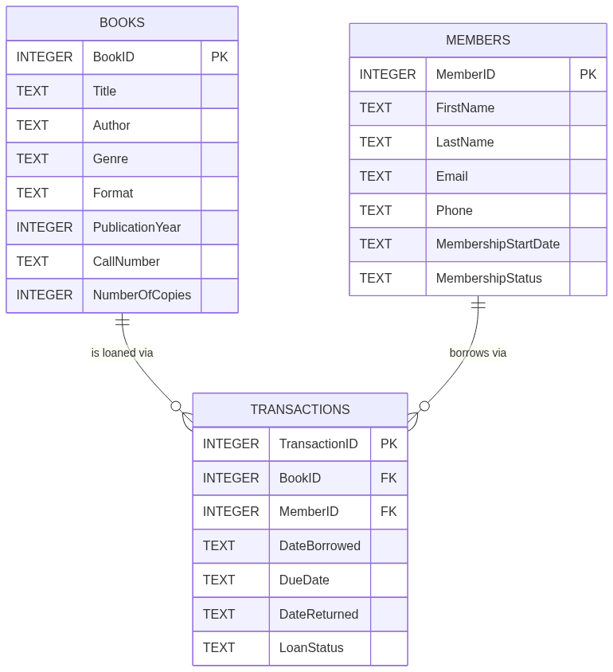
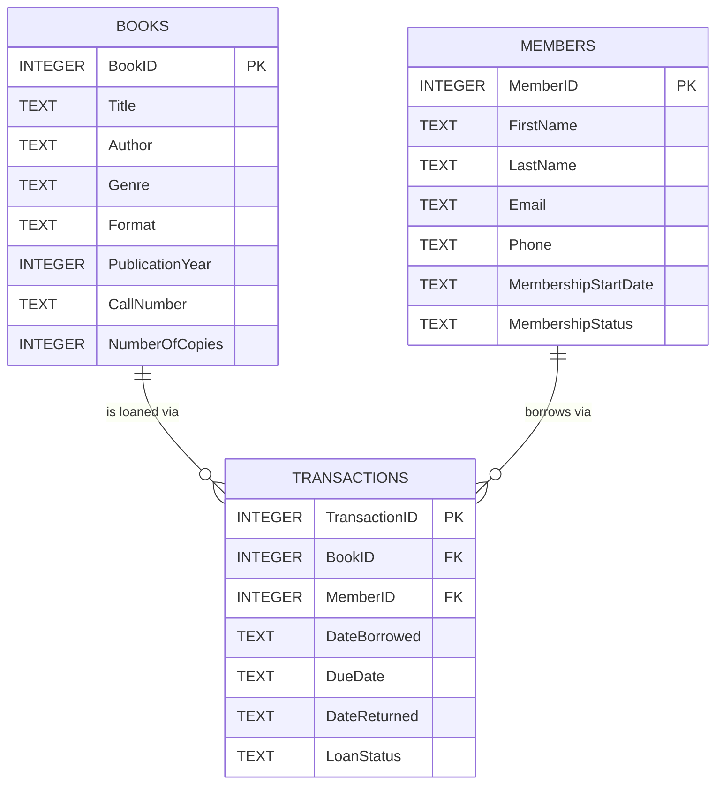

# library.db — Schema Summary

## Mermaid source

```mermaid
erDiagram
    BOOKS ||--o{ TRANSACTIONS : "is loaned via"
    MEMBERS ||--o{ TRANSACTIONS : "borrows via"

    BOOKS {
        INTEGER BookID PK
        TEXT Title
        TEXT Author
        TEXT Genre
        TEXT Format
        INTEGER PublicationYear
        TEXT CallNumber
        INTEGER NumberOfCopies
    }

    MEMBERS {
        INTEGER MemberID PK
        TEXT FirstName
        TEXT LastName
        TEXT Email
        TEXT Phone
        TEXT MembershipStartDate
        TEXT MembershipStatus
    }

    TRANSACTIONS {
        INTEGER TransactionID PK
        INTEGER BookID FK
        INTEGER MemberID FK
        TEXT DateBorrowed
        TEXT DueDate
        TEXT DateReturned
        TEXT LoanStatus
    }
```
